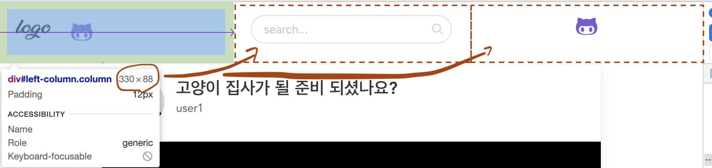

# Buefy , Bulma 적용

문서상 (?) Buefy가 내부적으로 Bulma의 스타일 옵션들을 사용해 만들어진 것 같다.  
Buefy에서 제공하는 컴포넌트, 옵션만을 활용하기엔 부족한 점이 있어서 Bulma 의 문서를 많이 참고했다.
따라서 아래의 내용은 `내가 스타일 컴포넌트에 대해 알게된 내용` + `거의 Bulma에 대한 내용`이라고 생각하면 된다.

1. Navbar (Bulma)
- Navbar는 상단 메뉴라고 생각하면 됨.
- 반응형을 제공하다보니 Mobile일 경우를 고려한 옵션이 있다.
    - ex) .navbar-brand: 항상 보임 / .navbar-menu: 화면 크기 줄어들면 안 보임.
- 적용 ex - Bulma 웹페이지)  
    - 오렌지색 박스를 왼쪽부터 보면 `.navbar-brand`, `.navbar-menu`, `암것도 아님`이 적용된 것이다.
    - 위 요소는 모두 `<nav>` 하위에 정의됨.
    - 각 옵션은 일부 규칙을 따르는데 `.nav-menu` 안에서만 `.nav-start, .nav-end`를 쓸 수 있다~ 뭐 이런 규칙이 있다. 이건 가운데 오렌지 박스에서 `Docs~ ...`까진 왼쪽 정렬(nav-start), `깃헙~Sponsor버튼`까진 오른쪽 정렬인 걸로 확인가능하다.
    
- 이슈) nav 옵션만 사용하려면 아래처럼 일정 크기가 유지되는 가운데 영역을 만들기가 어려운데, 그건 `<column>, <nav>` 를 섞어서 구현할 수 있었다. -> [README_ISSUE_NOTE.md](README_ISSUE_NOTE.md#1navbar에서-search-input창을-완전히-가운데-정렬하지-못함)
    